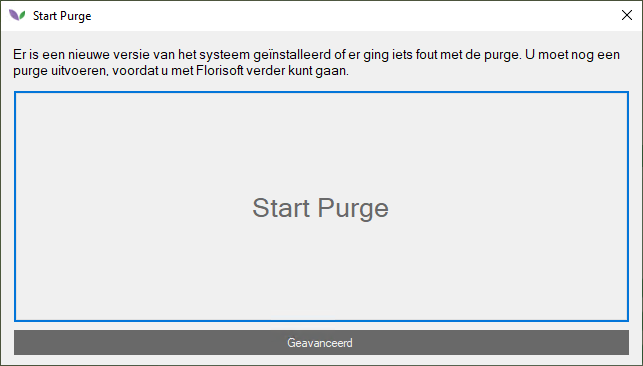
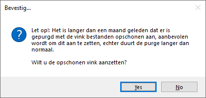
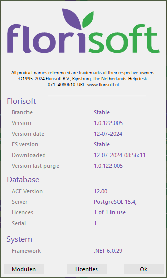
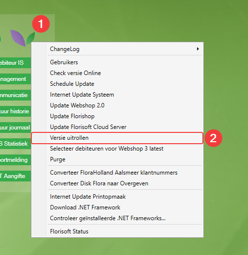
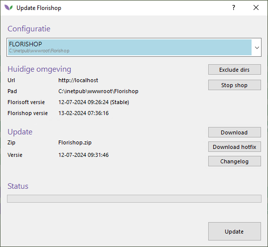
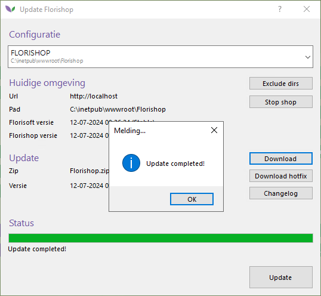

# Florisoft Update

### 1. Why do I need to perform an update?
An update of Florisoft is necessary when you have requested an adjustment within Florisoft (or Florisoft deems this adjustment necessary) and Florisoft has informed you that this adjustment is ready to be delivered.

### 2. How do I perform an update?
Follow these steps to start the update:

1. Start the `Florisoft Update shortcut`.  

> **Why update via a separate Florisoft shortcut?** 
This way, you only download the new Florisoft version onto a separate Florisoft client. The advantage of this approach is that you can test the new version without other users immediately logging into the latest version. If there are issues with the new version, everyone can continue working on the old version until the update is rolled out to all users.
  
If you do not yet have a `Florisoft Update shortcut` on your desktop, please contact our support department by email or phone to schedule setup.

2. Right-click on the `Florisoft Leaves icon` in the Navigator.

3. Choose the option `Internet Update System`.  

4. Answer the following question with `Yes`.  

5. Choose whether you want to download the `Stable` or `Latest` version. Read the explanations for both options to determine which version you need. If you are unsure, contact Florisoft during office hours.  

6. In the Florisoft Navigator, a screen will appear showing which files are being downloaded. Depending on your internet speed, this may take some time.  

7. Once the files are downloaded, you will receive a notification that Florisoft needs to be restarted and that you need to perform a purge.  

8. Restart Florisoft and perform the purge.  

### 3. How do I perform a purge?

1. After restarting Florisoft, the following screen will automatically appear. Click on `Start Purge`.  

2. If more than a month has passed since the last purge, you will be asked if you want to clean up files. Answer this question by clicking `Yes`.  

3. Now you will see the following screen:  

> With this type of purge, it is not necessary to log out system users or stop the webshop. This allows you to update the version without affecting other system users and the accessibility of the webshop.  
You can update the webshop and CloudServer at a later time. We recommend doing this on the same day at a suitable time.  
Instructions on how to update the webshop and CloudServer will be explained later in this document.

4. Choose `Start Online Purge`. If the online purge was successful, you will receive the following message:  

### 4. Was the update successful?
To check if the update was successful, click with the left mouse button on the `Florisoft Leaves icon` in the Navigator. You will see a date on the screen. Depending on the time of the update, this will be a recent date.

From Monday to Thursday, a new version of Florisoft is released online every morning at 08:00 (Dutch time). If you update from Monday to Thursday, you will see today's date on this screen. If you update on Friday, you will see the date from the previous day on this screen.

### 5. Rolling out the version

Once the latest version of Florisoft has been successfully tested by starting Florisoft via the `Florisoft Update shortcut` and everything is satisfactory, you can roll out the version to other users.

1. When starting the `Florisoft Update client`, you will receive the following message:  

2. If everything is satisfactory, you can roll out the version by right-clicking on the `Florisoft Leaves icon` in the Navigator and selecting the option `Roll out version`:  

3. Now you will see the following screen:  

4. Select the line with the name `BIN` using the left mouse button and click `OK`. You will now see a green bar running.  

5. Once this is complete, you will see the following screen. Click `OK`:  

The version has now been rolled out.

### 6. Updating the webshop

If it is acceptable for the webshop to be temporarily unavailable, you can update the webshop as follows.

1. Start the `Florisoft Update shortcut`.

2. Right-click on the `Florisoft Leaves icon` in the Navigator and select `Update Florishop`:  

3. Now you will see the following screen:  

4. Click `Update` to start the update.

5. Once the webshop update is complete, you will see the following screen. Now, check if the webshop is accessible again.  

### 7. Updating the CloudServer

If it is acceptable for the CloudServer to be temporarily unavailable, you can update the CloudServer as follows. Updating the CloudServer is done in the same way as updating the webshop.

1. Start the `Florisoft Update shortcut`.
   
2. Right-click on the `Florisoft Leaves icon` in the Navigator and select `Update Florisoft Cloud Server`:  

3. Now you will see the following screen:  

4. Click `Update` to start the update.

5. Once the CloudServer update is complete, you will see the following screen. Now, check if the CloudServer is accessible again.  

### 8. Roll out Apps

If you also use the Florisoft Apps, the apps can also be rolled out to the latest version. Through the same way as in chapter 5. But then the option: Roll out version Apps.
During an internet update system (from step 2), the apps are also downloaded.
After downloading, they can be rolled out via the Roll out version Apps option.
When the user restarts an app on the device, they will see that the app is being updated and will then run on the latest version.  

## Conclusion

This completes the Florisoft update process. If you have any questions or need assistance, please feel free to contact our support department. Thank you for using Florisoft!
